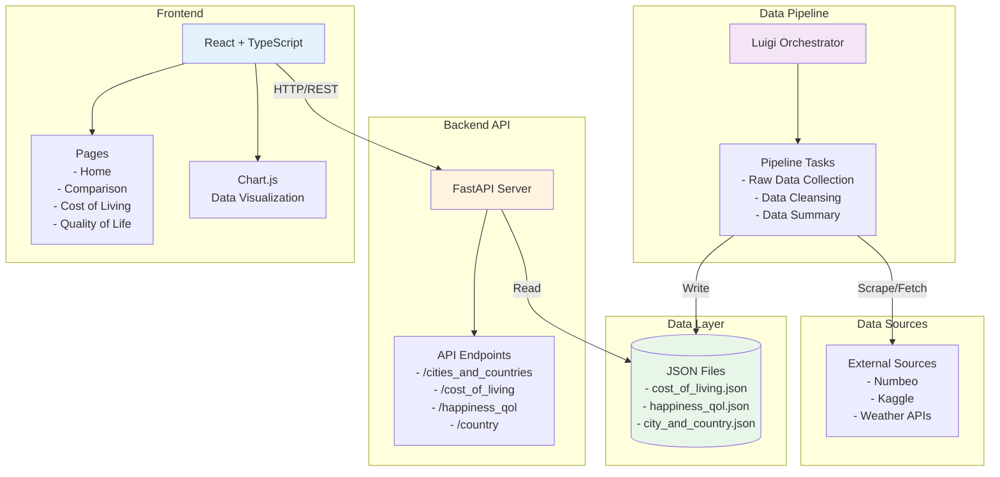
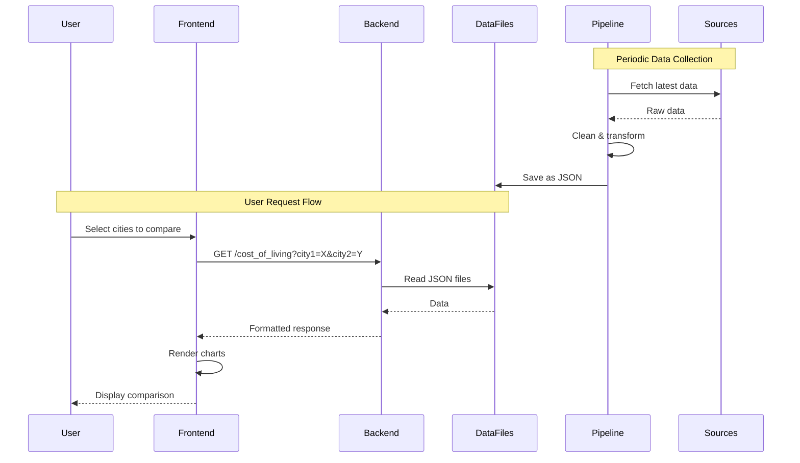

# City Data Comparison Platform - Architecture Overview

## System Architecture



## Technology Stack

### Frontend
- **React 19** - UI framework
- **TypeScript** - Type safety
- **Vite** - Build tool & dev server
- **Chart.js + react-chartjs-2** - Data visualization
- **Tailwind CSS 4** - Styling
- **React Router 7** - Client-side routing
- **Axios** - HTTP client

### Backend
- **Python 3.13** - Runtime
- **FastAPI** - Web framework
- **Uvicorn** - ASGI server
- **Pandas** - Data manipulation
- **Poetry** - Dependency management

### Data Pipeline
- **Luigi** - Task orchestration
- **BeautifulSoup4** - Web scraping
- **Requests** - HTTP requests
- **Pandas** - Data processing
- **scikit-learn** - Data analysis

### Infrastructure
- **Docker** - Containerization
- **Git + GitHub** - Version control

## Data Flow



## Key Features

1. **Multi-city Comparison** - Compare cost of living, quality of life, and happiness metrics
2. **Real-time Data Visualization** - Interactive charts using Chart.js
3. **Automated Data Updates** - Luigi pipeline collects fresh data periodically
4. **RESTful API** - Clean API design with FastAPI
5. **Type Safety** - TypeScript frontend with Python type hints

## Project Structure

```
presentation/
├── client-side/          # React frontend
│   ├── src/
│   │   ├── components/   # UI components
│   │   ├── pages/        # Route pages
│   │   ├── services/     # API integration
│   │   └── types/        # TypeScript types
│   └── package.json
├── server-side/          # FastAPI backend
│   ├── server_side/
│   │   └── main.py       # API endpoints
│   ├── Dockerfile
│   └── pyproject.toml
├── collection/           # Data pipeline
│   ├── collection/
│   │   ├── raw/          # Data fetching
│   │   ├── cleanse/      # Data cleaning
│   │   ├── summary/      # Data aggregation
│   │   └── main.py       # Luigi tasks
│   └── pyproject.toml
└── utils/                # Shared utilities
```