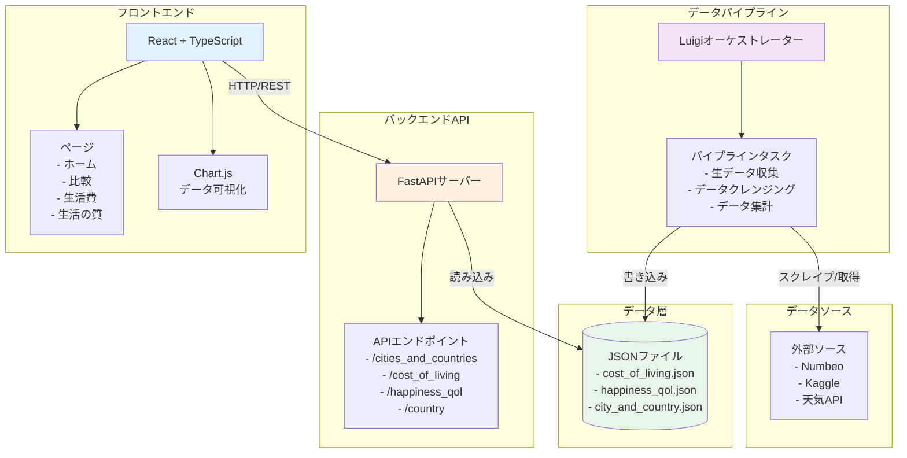
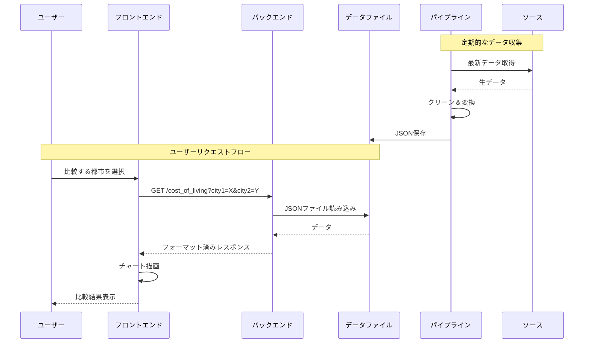

# 都市データ比較プラットフォーム - アーキテクチャ概要

## システムアーキテクチャ



## 技術スタック

### フロントエンド
- **React 19** - UIフレームワーク
- **TypeScript** - 型安全性
- **Vite** - ビルドツール＆開発サーバー
- **Chart.js + react-chartjs-2** - データ可視化
- **Tailwind CSS 4** - スタイリング
- **React Router 7** - クライアントサイドルーティング
- **Axios** - HTTPクライアント

### バックエンド
- **Python 3.13** - ランタイム
- **FastAPI** - Webフレームワーク
- **Uvicorn** - ASGIサーバー
- **Pandas** - データ操作
- **Poetry** - 依存関係管理

### データパイプライン
- **Luigi** - タスクオーケストレーション
- **BeautifulSoup4** - Webスクレイピング
- **Requests** - HTTPリクエスト
- **Pandas** - データ処理
- **scikit-learn** - データ分析

### インフラストラクチャ
- **Docker** - コンテナ化
- **Git + GitHub** - バージョン管理

## データフロー



## 主要機能

1. **複数都市比較** - 生活費、生活の質、幸福度指標の比較
2. **リアルタイムデータ可視化** - Chart.jsによるインタラクティブチャート
3. **自動データ更新** - Luigiパイプラインによる定期的な新鮮なデータ収集
4. **RESTful API** - FastAPIによるクリーンなAPI設計
5. **型安全性** - TypeScriptフロントエンドとPython型ヒント

## プロジェクト構造

```
presentation/
├── client-side/          # Reactフロントエンド
│   ├── src/
│   │   ├── components/   # UIコンポーネント
│   │   ├── pages/        # ルートページ
│   │   ├── services/     # API統合
│   │   └── types/        # TypeScript型定義
│   └── package.json
├── server-side/          # FastAPIバックエンド
│   ├── server_side/
│   │   └── main.py       # APIエンドポイント
│   ├── Dockerfile
│   └── pyproject.toml
├── collection/           # データパイプライン
│   ├── collection/
│   │   ├── raw/          # データ取得
│   │   ├── cleanse/      # データクリーニング
│   │   ├── summary/      # データ集計
│   │   └── main.py       # Luigiタスク
│   └── pyproject.toml
└── utils/                # 共有ユーティリティ
```